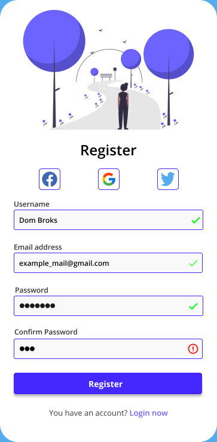
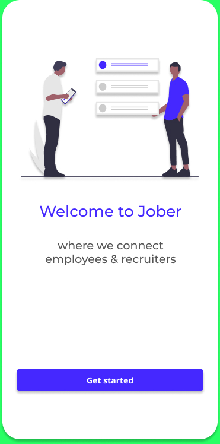
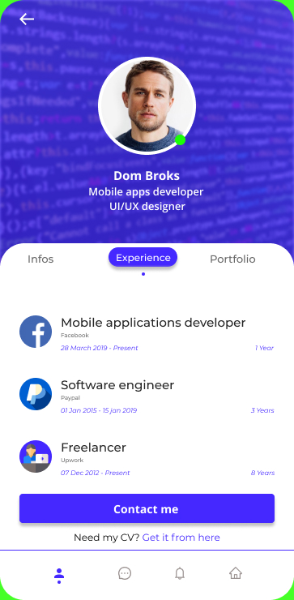
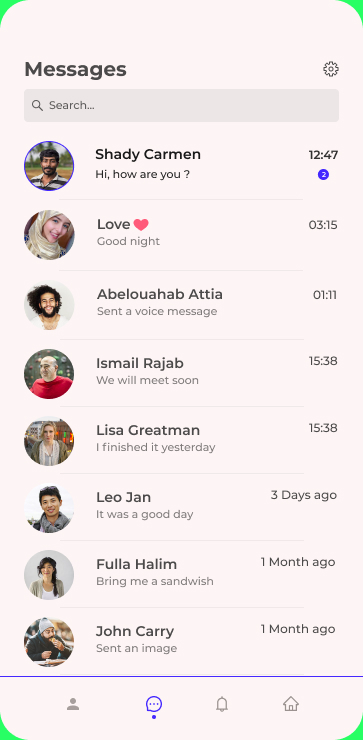

# Hire_Me

## Project Description

This project is created in order to help people whether the are searching for a job or seaching for an emplyee. For example, recuiters in companies can open an
account in this app and post some announcement for their offers or they can directly search for someone who has the requirements that make him eligible to apply to this job. The app is still underconstruction and i will add new features everytime.

The Design is made by me (Figma project is available).

## Some technical informations about the app:

- Dagger-Hilt for dependency injection.
- MVVM architecture.
- LivaData.
- Kotlin coroutines.
- RxJava.
- Navigation component.
- DataBinding.
- Firebase services (Authentication,Storage,Database).
- And More...

## Screenshots:

    
    
    

## How to Run 

For getting more understanding, you can donwload the project and upload it to your android studio.

## Notes 

-Any contribution is welcome. Feel free to contribute.

-if you faced some problems, just contact me, i will be more than happy to help you.

## Contact

This is my email : tinoutech@gmail.com

This is my LinkedIn account : https://www.linkedin.com/in/younes-belouche-641bb3197/
